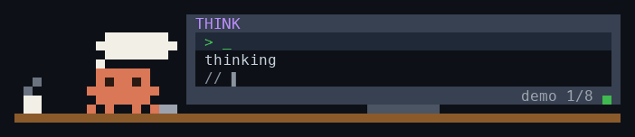
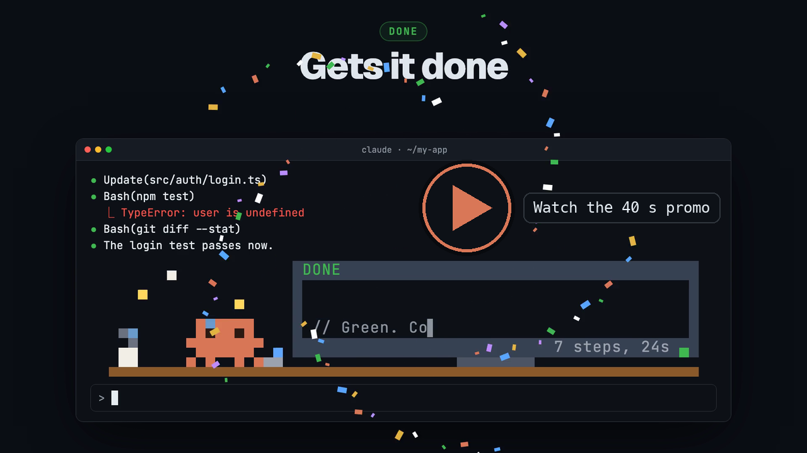

# agent-theater

A tiny pixel theater above your Claude Code prompt. Little orange Claude sits at a desk and acts out whatever the agent is doing, while the monitor beside him shows the real command or file and a one-line narration.



### Promo (40 s, sound on)

[](docs/agent-theater.mp4)

| Scene | Claude | Monitor |
|---|---|---|
| think | thought bubble over his head, then a light bulb when the idea lands | `> _` `thinking...` |
| read | flips the pages of a book, eyes scanning | `$ cat <file>` with code scrolling |
| edit | types, keys lighting up | `$ vim <file>` with the edit typing out |
| test | thumps the monitor | a progress bar filling |
| run | hits Enter while a cog spins over his head | `$ <command>` with a spinner |
| error | scowls, flushes red, arms flailing, steam puffing | the screen flashes red with the real error |
| done | arms up, confetti | `✓ OKAY` and a summary of the turn |

The narration is written by Haiku in the voice of a calm senior engineer, in the language of your request. When a step drifts away from what you asked, the narration and the monitor's title turn yellow and say `off track`.

## Install

Needs Claude Code **2.1.287 or later** (`claude --version`). Mods run in the terminal and the desktop Code tab.

Inside Claude Code:

```
/plugin marketplace add afu-it/agent-theater
/plugin install agent-theater@agent-theater
/reload-plugins
```

Or from your shell:

```
claude plugin marketplace add afu-it/agent-theater
claude plugin install agent-theater@agent-theater --scope user
```

If the theater does not show up, restart Claude Code.

## Use

| Command | What it does |
|---|---|
| `/theater` | Turn it on or off (remembered across sessions) |
| `/theater on` / `/theater off` | Set it explicitly |
| `/theater demo` | Play all eight scenes, three seconds each |

The theater follows the main agent only; subagents are left out.

## Cost

Each narration is one small Haiku call on your own account: at most one every four seconds while tools run, plus one summary when a turn ends. Turn it off with `/theater off` and no calls are made.

## Develop

```
git clone https://github.com/afu-it/agent-theater
claude --plugin-dir ./agent-theater/plugins/agent-theater
claude plugin validate ./agent-theater/plugins/agent-theater
claude plugin test ./agent-theater/plugins/agent-theater
```

The folder is watched, so every save reloads the mod. The art lives in `hooks/stage.ts`; the hooks, timers and narration in `hooks/register.tsx`.

The promo is a [Remotion](https://www.remotion.dev) project in `videos/`. It draws the theater with the mod's own `stage.ts`, so the film matches the terminal frame for frame. Music and sound effects are not in the repo; add your own under `videos/public/bgm/chiptune.wav` and `videos/public/sfx/`, then:

```
cd videos && npm install
npx remotion render src/index.ts TheaterWide out/agent-theater-wide.mp4
npx remotion render src/index.ts TheaterTall out/agent-theater-tall.mp4
```

## Uninstall

```
/plugin uninstall agent-theater@agent-theater
```

## License

MIT
